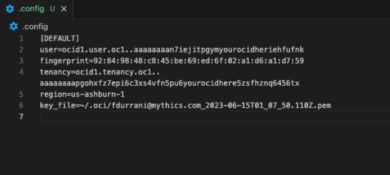

# OCI CLI Configuration

To manage OCI resources remotely with Terraform or Oracle CLI, you first need an OCI CLI configuration file that contains your user profile credentials.

OCI configuration file : a profile is a named set of configuration settings stored in your local OCI configuration file. It allows you to manage multiple OCI accounts, users, or environments from the same machine.

## Step 1: Set up the OCI configuration profile

1. Create the `~/.oci` directory.
	- This directory stores your OCI API credentials.

2. Create an API key in Oracle Cloud Console.
	- Go to: **Profile Picture > My Profile > API Keys > Add API Key**


	- Download the **private key** (downloading the public key is optional).
	- Click **Add**. A configuration file preview appears.


3. Put the API key details into your config file.
	- Copy the generated configuration content and paste it into `~/.oci/config`.
	- Create the file if it does not already exist.
	- `key_file` should point to the private key you downloaded (for example, a file stored in `~/.oci`).



user – OCID of the user making the API call
fingerprint – Fingerprint of the API key
key_file – Path to the private key file
tenancy – OCID of your tenancy
region – OCI region (e.g., us-ashburn-1)

## Terraform deployment (modular)

This folder now provisions:
- A root-level compartment named `oci-infra-test` directly under the tenancy root.
- Two VCNs (from `vcns` map input), each with:
	- 1 public subnet
	- 1 private subnet
	- 1 Internet Gateway (IGW)
	- 1 NAT Gateway
	- route tables and ingress/egress security rules
- E2 compute instance(s) from the `instances` map.

### Modules

- `modules/vcn`: reusable network module for one VCN stack.
- `modules/compute`: reusable instance module.

### Run

From `oci-infra/`:

1. Fill values in `terraform.tfvars`:
	 - `tenancy_ocid`
	 - `instances[*].image_ocid`
	 - `instances[*].ssh_authorized_keys`
2. Initialize and plan:

```bash
terraform init
terraform plan
```

3. Apply:

```bash
terraform apply
```